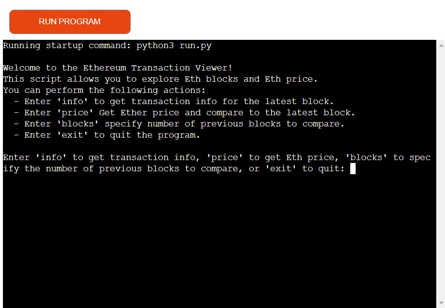
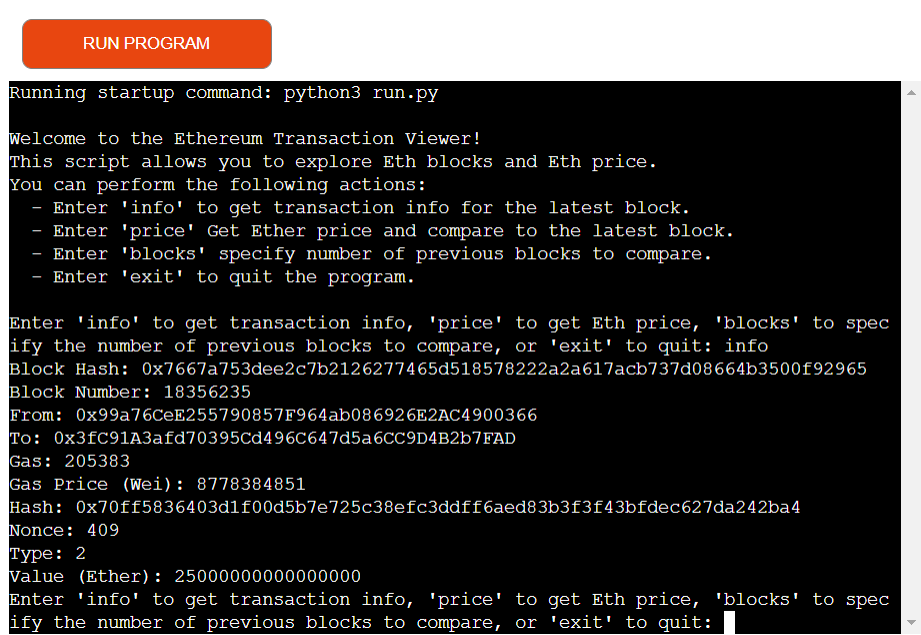
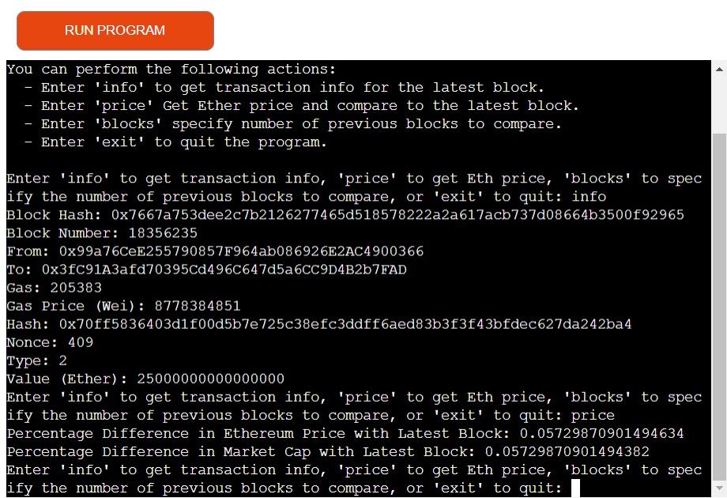
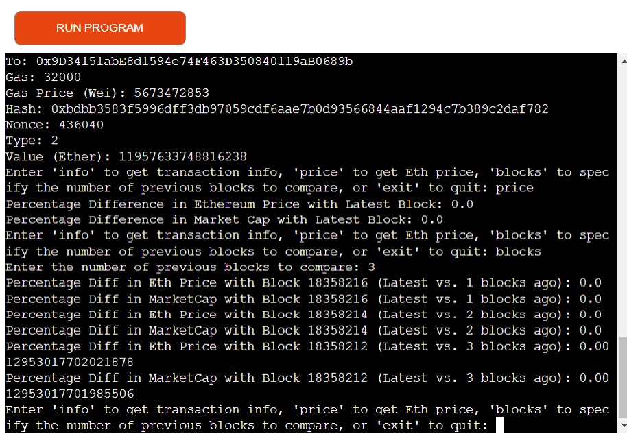

# Ethereum Transaction Viewer


Welcome to the Ethereum Transaction Viewer! This Python script enables you to explore Ethereum (ETH) blocks and Ethereum's price using the Web3 library and CoinMarketCap API. You can perform the following actions:

- Get transaction information for the latest block.
- Retrieve the current Ethereum price and compare it to the latest block.
- Specify the number of previous blocks to compare with the latest block.
- Enter blockhash to compare a specific block.
- Exit the program.


## Purpose and Goals of the Application

**Purpose:**
This Python script serves as an interactive tool for users interested in exploring the Ethereum blockchain and monitoring the price of Ethereum (ETH) from CoinMarketCap. It provides the following functions:

**Goals:**
1. **Transaction Information:** Allow users to retrieve and display detailed information about transactions on the Ethereum blockchain. Users can explore specific transaction details, including block number, sender, receiver, gas, and more.

2. **Ethereum Price Tracking:** Enable users to obtain real-time data on the price of Ethereum (ETH) in USD and compare it to the latest block. This feature helps users stay updated on the cryptocurrency market.

3. **Historical Data Comparison:** Allow users to specify a number of previous blocks to compare with the latest block. The script calculates and displays the percentage differences in Ethereum price and market capitalization between the latest block and the selected historical blocks.

4. **User-Friendly Interface:** Provide a user-friendly command-line interface with clear instructions and prompts for available actions, such as 'info,' 'price,' 'blocks,' and 'exit.'

5. **Continuous Updates:** Ensure the script continuously updates and tracks the latest block's data and Ethereum price, providing users with the most up-to-date information.

6. **Error Handling:** Implement robust error handling to gracefully manage network issues, API errors, and invalid user inputs, enhancing the application's reliability.

The primary objective of the application is to empower users to explore Ethereum transactions and monitor Ethereum's real-time price, facilitating a better understanding of the cryptocurrency ecosystem.

## User Stories

- **Blockchain Enthusiasts:** For blockchain enthusiasts, the Ethereum Transaction Viewer offers the ability to explore Ethereum transactions, keeping them up-to-date with the latest developments in the Ethereum network.

- **Crypto Investors:** Individuals interested in cryptocurrency investments can use the Ethereum Transaction Viewer to monitor the real-time price of Ethereum (ETH) and analyze it in comparison to the latest block, aiding their investment decisions.

- **Historical Data Analysts:** Users looking to understand the historical performance of Ethereum can specify a number of previous blocks to compare with the latest block. This feature enables them to analyze percentage differences in Ethereum price and market capitalization over time.

- **Researchers:** Researchers investigating Ethereum's blockchain can gather valuable transaction information and insights using the Ethereum Transaction Viewer, enhancing their understanding of this blockchain technology.

- **Educators:** Educators in the field of blockchain and cryptocurrencies can recommend the Ethereum Transaction Viewer to their students as a practical tool for exploring real-world transactions and monitoring Ethereum's price, thereby facilitating the learning process.

## Usage

Upon running the script, you will be presented with the following options:

- Enter 'info' to get transaction information for the latest block.
- Enter 'price' to get the current Ethereum price and compare it to the latest block.
- Enter 'blocks' to specify the number of previous blocks to compare with the latest block.
- Enter 'exit' to quit the program.

## Functions

### `display_transaction_info(tx)`

This function displays transaction information for a given transaction.

### `get_transaction_info(block_hash)`

Retrieves and displays transaction information for a given block hash.

### `wei_to_ether(wei)`

Converts an amount in Wei to Ether.

### `get_ethereum_price(api_key)`

Retrieves Ethereum price and market cap data from CoinMarketCap API using your API key.

### `compare_block_with_price(latest_ethereum_price)`

Compare the Ethereum price with a user-specified block.

### `calculate_percentage_difference(value1, value2)`

Calculates the percentage difference between two values.

## Technology Used

###The technology used in this project is as follows:

- [Python](https://en.wikipedia.org/wiki/Python_(programming_language)) - Python is a versatile and high-level programming language known for its simplicity and readability, suitable for a wide range of applications.

- [Code Institute Python Essentials Template](https://github.com/Code-Institute-Org/p3-template) - GitHub repository template used to create the repository.

- [Visual Studio Code](https://code.visualstudio.com/) - source code editor used to create, edit and publish the webpages with the assistance of Git/GitHub/GitPages.

- [Heroku](https://heroku.com/) - Cloud application hosting service.

- [GitHub](https://github.com/) - Git repository hosting service with a web-based graphical interface.

- [Web3](https://pypi.org/project/web3/) - A Python library for interacting with the Ethereum blockchain. It provides the necessary functionality to connect to an Ethereum node, retrieve blockchain data, and work with Ethereum transactions.

- [Python-Dotenv](https://pypi.org/project/python-dotenv/) - A Python library used for loading environment variables from a .env file. It helps securely manage sensitive information like API keys and URLs.

- [Requests](https://pypi.org/project/requests/) - A Python library for making HTTP requests. It's used in this script to communicate with the CoinMarketCap API to retrieve Ethereum price and market cap data.

- [Infura](https://www.infura.io/) - Infura provides Ethereum nodes as a service. It's likely used as the Ethereum node provider for interacting with the Ethereum blockchain.

- [CoinMarketCap](https://pro.coinmarketcap.com/) - The script uses the CoinMarketCap API to obtain real-time data on Ethereum's price and market capitalization. Users need an API key from CoinMarketCap to access this data.

These technologies are integrated to create an application that allows users to explore Ethereum transactions and monitor the real-time price of Ethereum.

## Bugs

- Error in indentation for the blocks loop, the programme would not function as intended.

# Ethereum Transaction Viewer Deployment Guide

This guide will walk you through the deployment process for the Ethereum Transaction Viewer script. This script allows you to explore Ethereum blocks and compare Ethereum prices with different blocks.

## Prerequisites

Before deploying the Ethereum Transaction Viewer, make sure you have the following prerequisites installed on your system:

- Python (3.6 or higher)
- `pip` (Python package manager)
- `git` (optional for cloning the repository)
- An Infura API key
- A CoinMarketCap API key

## Deployment Steps

1. **Clone or Download the Repository**

    You can either clone the GitHub repository or download the script directly. Here's how to clone the repository:

    ```bash
    git clone https://github.com/grampers-dev/ethereum-transaction-viewer.git
    ```

2. **Navigate to the Project Directory**

    Change your current working directory to the project directory:

    ```bash
    cd ethereum-transaction-viewer
    ```

3. **Install Required Python Packages**

    Use `pip` to install the necessary Python packages listed in the `requirements.txt` file:

    ```bash
    pip install -r requirements.txt
    ```

4. **Create a `.env.apikeys` File**

    Create a file named `.env.apikeys` in the project directory. This file will store your API keys for Infura and CoinMarketCap. Open the file in a text editor and add the following content:

    ```plaintext
    INFURA_URL=https://mainnet.infura.io/v3/your-infura-api-key
    CMC_API_KEY=your-coinmarketcap-api-key
    ```

    Replace `your-infura-api-key` and `your-coinmarketcap-api-key` with your actual API keys.

5. **Run the Script**

    You can now run the Ethereum Transaction Viewer script:

    ```bash
    python ethereum_transaction_viewer.py
    ```

    Follow the on-screen instructions to interact with the script. You can explore Ethereum blocks, compare prices, and more.

6. **Usage**

    - Enter `info` to get transaction information for the latest block.
    - Enter `price` to fetch Ethereum price and compare it to the latest block.
    - Enter `blocks` to specify the number of previous blocks to compare.
    - Enter `blockhash` to compare a specific block.
    - Enter `exit` to quit the program.

## Conclusion

You have successfully deployed the Ethereum Transaction Viewer on your local machine. You can now explore Ethereum blocks and analyze transaction data. If you plan to deploy this script in a production environment, consider additional security and scalability measures.

Enjoy using the Ethereum Transaction Viewer!


## 📦 Dependencies

The Ethereum Transaction Viewer application relies on the following Python libraries and packages. To ensure proper functionality, make sure to install these dependencies in your environment:

<details>
<summary>Click here to view the list of dependencies</summary>

- aiohttp==3.8.6
- aiosignal==1.3.1
- async-timeout==4.0.3
- bitarray==2.8.2
- cytoolz==0.12.2
- eth-abi==4.2.1
- eth-account==0.9.0
- eth-hash==0.5.2
- eth-keyfile==0.6.1
- eth-keys==0.4.0
- eth-rlp==0.3.0
- eth-typing==3.5.0
- eth-utils==2.2.2
- frozenlist==1.4.0
- hexbytes==0.3.1
- lru-dict==1.2.0
- multidict==6.0.4
- parsimonious==0.9.0
- protobuf==4.24.4
- pycryptodome==3.19.0
- pyunormalize==15.0.0
- regex==2023.10.3
- rlp==3.0.0
- toolz==0.12.0
- web3==6.11.0
- websockets==11.0.3
- yarl==1.9.2
- python-dotenv==0.17.1

</details>

 ## 📝 Testing 

 ### ✅ Validation

 - My run.py passed the [CI Python Linter](https://pep8ci.herokuapp.com/) with no errors.

 - *run.py* 
  
   

### 🧪 Manual Testing 
1. Program startup.
   
   
2. User input info.

   
3. User input price.

   
4. User input blocks.

   
   


